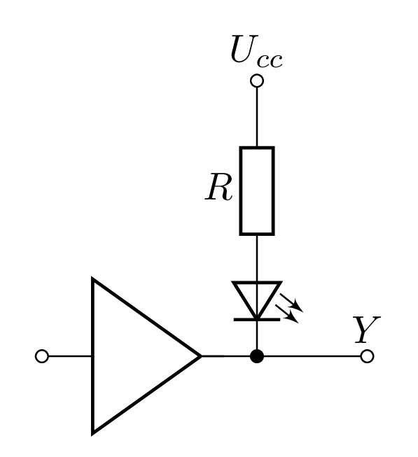
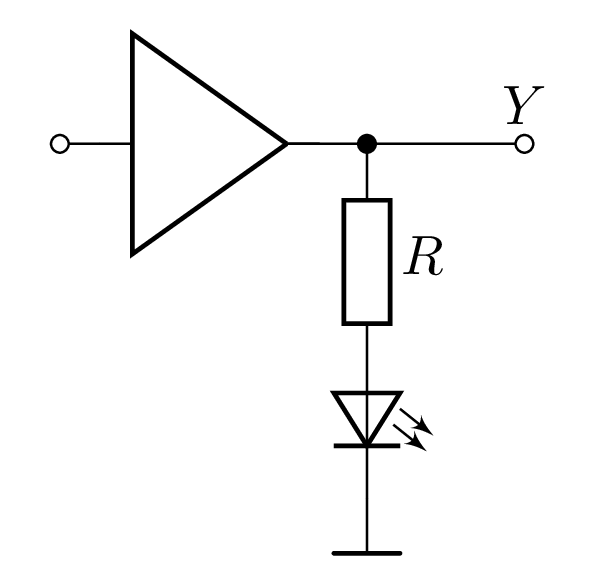
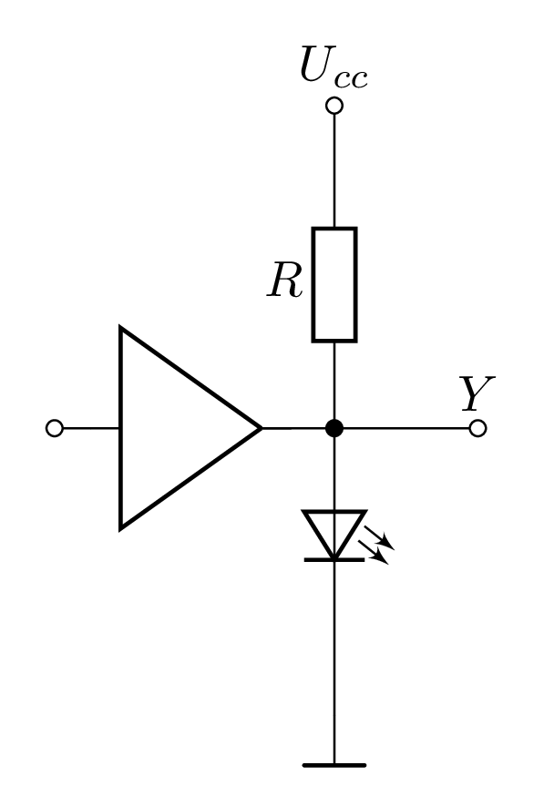
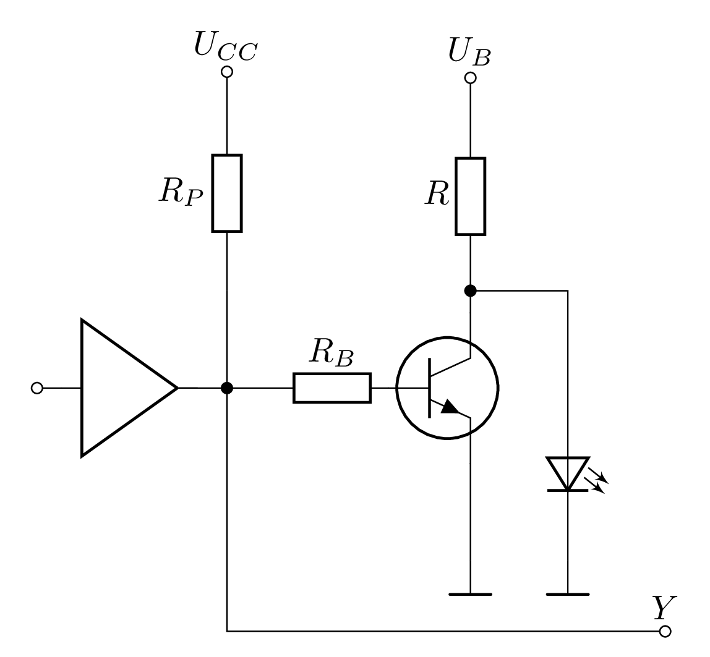
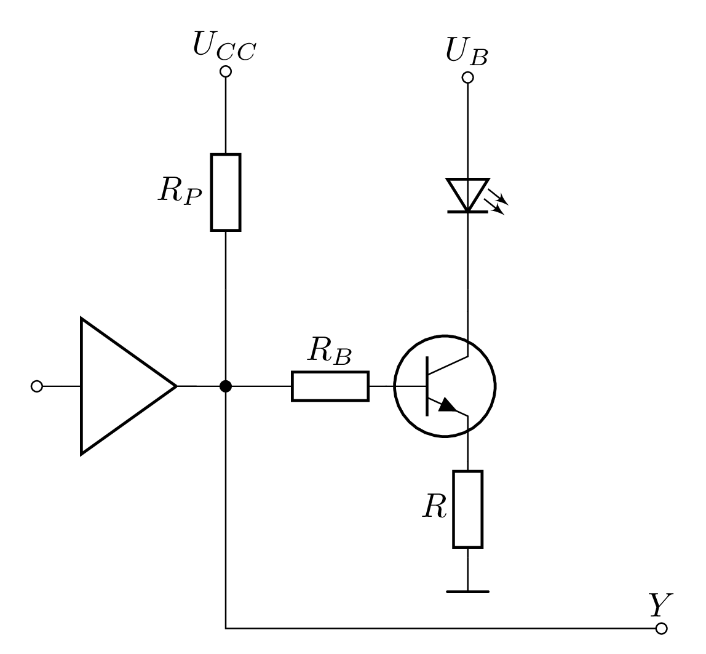

# Zapojení LED k výstupům hradel

## Zapojení bez transizstoru

|          |                            |                  |                        |
|----------|----------------------------| :--------------: |------------------------|
| Log. `0` | [Zapojení I.](#zapojení-i) | **ANO**  Odebíraný proud musí být nižší než $I_{VÝST}$ v log. `0` a proud diody. | $R = \frac{U_{CC} -(U_{DD} + U_{VÝST_{LOG. 0}})}{I_D}$ |
| Log. `1` | [Zapojení II.](#zapojení-ii) | **NE**  Proud diodyje vždy vyšší než $I_{VÝST}$ v log. `1`. | $R = \frac{U_{VÝST_{LOG. 1}} -U_{DD}}{I_D}$ |
| Log. `1` | [Zapojení III.](#zapojení-iii)  | **NE**  Napětí diody je vždy nižší než $U_{VÝST}$ v log. `1`. | $R = \frac{U_{CC}-U_{DD}}{I_D}$ |

## Zapojení s tranzistorem

|                            |                  |                        |
|----------------------------| :--------------: |------------------------|
|  [Zapojení s tranzistorem I.](#zapojení-s-tranzistorem-i) | **ANO**  Odebíraný proud musí být nižší než $I_{VÝST}$ v log. `1` a proud báze. | $R = \frac{U_{CC} -(U_{DD} + U_{VÝST_{LOG. 0}})}{I_D}$ |
| [Zapojení s tranzistorem II.](#zapojení-s-tranzistorem-ii) | **ANO**  Proud diodyje vždy vyšší než $I_{VÝST}$ v log. `1`. | $R = \frac{U_{VÝST_{LOG. 1}} -U_{DD}}{I_D}$ |
| [Zapojení s tranzistorem II.](#zapojení-s-tranzistorem-iii) | **ANO**  Napětí diody je vždy nižší než $U_{VÝST}$ v log. `1`. | $R = \frac{U_{CC}-U_{DD}}{I_D}$ |
| [Zapojení s tranzistorem II.](#zapojení-s-tranzistorem-iv) | **ANO**  Napětí diody je vždy nižší než $U_{VÝST}$ v log. `1`. | $R = \frac{U_{CC}-U_{DD}}{I_D}$ |

## Schémata zapojení

### Zapojení I.
<picture>
  <source media="(prefers-color-scheme: dark)" srcset="./TTL_Hradlo_LED__1_flatten.png">
  <source media="(prefers-color-scheme: light)" srcset="./TTL_Hradlo_LED__1.png">
  
</picture>

### Zapojení II.
<picture>
  <source media="(prefers-color-scheme: dark)" srcset="./TTL_Hradlo_LED__2_flatten.png">
  <source media="(prefers-color-scheme: light)" srcset="./TTL_Hradlo_LED__2.png">
  
</picture>

### Zapojení III.
<picture>
  <source media="(prefers-color-scheme: dark)" srcset="./TTL_Hradlo_LED__3_flatten.png">
  <source media="(prefers-color-scheme: light)" srcset="./TTL_Hradlo_LED__3.png">
  
</picture>

### Zapojení s tranzistorem I.
<picture>
  <source media="(prefers-color-scheme: dark)" srcset="TTL_Hradlo_LED_T__1_flatten.png">
  <source media="(prefers-color-scheme: light)" srcset="TTL_Hradlo_LED_T__1.png">
  
</picture>

### Zapojení s tranzistorem II.
<picture>
  <source media="(prefers-color-scheme: dark)" srcset="TTL_Hradlo_LED_T__2_flatten.png">
  <source media="(prefers-color-scheme: light)" srcset="TTL_Hradlo_LED_T__2.png">
  
</picture>

### Zapojení s tranzistorem III.
<picture>
   <source media="(prefers-color-scheme: dark)" srcset="TTL_Hradlo_LED_T__3_flatten.png">
  <source media="(prefers-color-scheme: light)" srcset="TTL_Hradlo_LED_T__3.png">
  
</picture>

### Zapojení s tranzistorem IV.
<picture>
  <source media="(prefers-color-scheme: dark)" srcset="TTL_Hradlo_LED_T__4_flatten.png">
  <source media="(prefers-color-scheme: light)" srcset="TTL_Hradlo_LED_T__4.png">
  
</picture>
